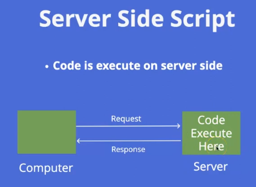
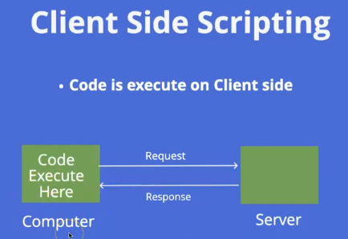
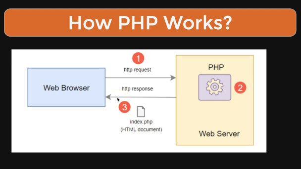
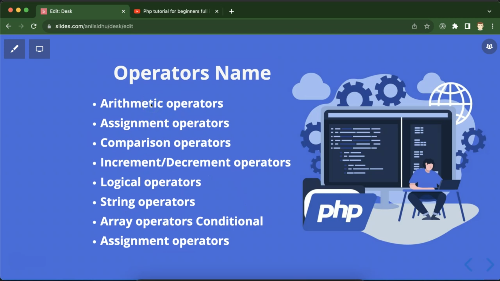

# php Language Note

---

### 🔗 Learn Links

- 👨‍💻1️⃣ [Basic php Crash Course](https://www.youtube.com/watch?v=_TST9dVptls)

- 👉 [Basic Playlist - H](https://www.youtube.com/playlist?list=PL8p2I9GklV44cSOlKzB_0TrzxEgwfvicK)

- 👉 [PHP For Beginners - Complete Laracasts Course](https://www.youtube.com/watch?v=fw5ObX8P6as&list=PL3VM-unCzF8i1GY_NqCRNE-TUZhUIak5l)

- 👉 [Basic To Advance - E](https://www.youtube.com/playlist?list=PLr3d3QYzkw2xabQRUpcZ_IBk9W50M9pe-)

- 👉 [Basic To Advance - H](https://www.youtube.com/playlist?list=PL0b6OzIxLPbyrzCMJOFzLnf_-_5E_dkzs)

* 👉 https://www.phptutorial.net/

* 👉

---

## http://localhost/learnPHP/01_index.php

---

### Note

- php -> hypertext Preprocessor
- php -> server-side scripting language
  
  

- Case Sensative না
- variable এর ক্ষেত্রে Case Sensative
- [.] dot হচ্ছে concatenation

---

### CODE

```php
<?php
    echo "Hello World";
?>
```

---

### Comment

```php

# Single Line ❌
// Single Line
/* Multiline*/

```

#### Echo in php

- display output
- echo is INcase-sesative

```php
    echo "Hello PHP echo";
    ECHO "Hello ECHO";
```

#### Variable in php

```php
  $num = 10;
  $num2 = 20;
  $result = $num + $num2;
  echo $result."<br>";
  var_dump($result)
```

##### Varible Rulse

- variable start with $
- variable name can't start number / spacial caractrer
- variable name start with \_ or letter
- variable is case sebsative

#### PHP in HTML

```php
echo "<h1 style='color:red'>Php with Html<h1>";
echo "<h2 style='color:green'>Php with Html<h2>";
echo "<h3 style='color:teal'>Php with Html<h3>";


<?php
   $name = "Hello PHP";
   $red = "red";
   $green = "green";

?>

<h1 style='color:<?php echo $red?>'>Now LEarning <?php echo $name; ?></h1>
<h1 style='color:<?php echo $green?>'>Now LEarning <?php echo $name; ?></h1>

```

#### ERROR PHP

- find php.ini
- find display_error & on

### Constant

### DataType

```php

<?php
    echo "DataType". "<br>";

    echo "String";
    $name = "hello 'World' Php";
    var_dump($name . "<br>");
    echo $name . "<br>";


    echo "Integer". "<br>";
    $num = 12345678;
    echo $num . "<br>";
    var_dump($num);


    echo "Float". "<br>";
    $num = 3.1416;
    echo $num;
    var_dump($num);


    echo "Boolean". "<br>";
    $isLogin = true;
    var_dump($isLogin)


    echo "null". "<br>";
    $noValuel = null;
    // $noValuel; -> Undefined
    echo var_dump($noValuel);

    echo "Array". "<br>";
    $arr = ["Php","Javascript","Python","C","c++", 5];
    echo var_dump($arr);


    echo "Object(Class)". "<br>";
    $user = new className();


    echo "Recourse". "<br>";
    // store data in database / ftp connect

    $connection = ftp_connect("127.0.0.1") or die("Local Host Not FOund");
    echo var_dump($connection);

?>
```

### How PHP WORKS



- browser -> Request[php -> interprate[exicute] & Convert html Code] -> Server
- browser <- Request[index.php afterCompile html Doc] <- Server
- inspact element -> Request for chack Server Request

### Operator



##### Arithmatic Operator

> - | - | \* | / | \*\* | %

```php
<?php
// Arithmatic Operator
echo "Arithmatic Operator" . "<br>";

$num1 = 12;
$num2 = 2;

$result = $num1 + $num2;
$result = $num1 - $num2;
$result = $num1 * $num2;
$result = $num1 / $num2;
$result = $num1 % $num2;
$result = $num1 ** $num2;

echo "Number is " . $result;
?>
```

##### Assignment Operator

> = | += | -= | \*= | /= | %=

```php
<?php
 => Assignment Operator
echo "Assignment Operator" . "<br>";

$num1 = 12;
$num2 = 2;
$result = $num1 + $num2;

// $num3 = $num1;
$num1 += $num2; //=> $num2 = $num2 + $num2  = 12+2 => 14
$num1 -= $num2; //=> $num2 = $num2 - $num2  = 12-2 => 10
$num1 *= $num2; //=> $num2 = $num2 * $num2  = 12*2 => 24
$num1 /= $num2; //=> $num2 = $num2 / $num2  = 12/2 => 6
$num1 %= $num2; //=> $num2 = $num2 % $num2  = 12%2 => 0

echo $num1;

echo "Number is " . $result;
?>
```

##### Comparison Operator

> == | === | < | > | >= | <= | <> | != | !== | <=>

- <=> Spaceship Operator
- var_dump($num1 <=> $num2)
- ৩ টা ভ্যেলু একসাথে কম্পেয়ার করে
  - Less then < -1
  - Equal = 0
  - Grater Then > 1

```php
<?php
// => Comparison  Operator
echo "Comparison Operator" . "<br>";

$num1 = 12;
$num2 = 112;

$result = $num1 == $num2;
$result = $num1 === $num2;
$result = $num1 != $num2;
$result = $num1 !== $num2;
$result = $num1 <> $num2; //=> not Equal
$result = $num1 > $num2;
$result = $num1 >= $num2;
$result = $num1 < $num2;
$result = $num1 <= $num2;
$result = $num1 <=> $num2; < -1 / = 0 / > 1
var_dump($num1 <=> $num2)

// echo $result;
?>
```

### Foreach

- Use in array Item Travering
- foreach is a loop

```php

<?php

    $users = ["A","B","C","D","E","F"];

    foreach($users as $user){
        echo $user;
    }
    echo "<br> <hr> <br>";
    foreach($users as $userList):
        echo $userList;
    endforeach;
?>

```

### Local & Global Variable

##### ✨ Local Variable

- Function এর ভিতরে কাজ করে

```php
<?php

  function getName(){
      $name = "shanto";
      echo($name);
  }

  echo $name; |> Error, can't access outside
  getName()

?>

```

##### ✨ Global Variable

- Create outide the function and access everywhere
- use sameName -> Global & Local Variable
- global Variable ব্যবহার এর জন্য function এর ভিতরে global কিওয়ার্ড দিতে হয়

```php
<?php

  function getName(){
      $name = "shanto";
      echo($name);
  }

  echo $name; |> Error, can't access outside
  getName()

?>

##### ✨
```

##### ✨ Global Variable inside function

- change Global Variable inside the function

```php

<?php

    // * change Global Variable inside the function
    $name = "Saiufl ";

    function getName(){
        global $name;
        // -> Update Global Variable
        $name = "shanto ";
        echo($name. "Inside Function <br>");
    }

    getName();
    echo($name. "Outside Function <br>");

?>
```

##### ✨ Global Variable inside function

```php

<?php

$name = "Saiful - G 1 <br>";
function test(){
    // $name = "Islam - L  2<br>";
    global $name;
    echo $name;

    function innerTest(){
        $name = "Shanto - N L 3<br>";
        echo $name;
    }

}

echo $name;
test();
innerTest();

?>
```

### Php file intraction with HTML

- html এর ডাটাকে Php এর মধ্যে নিয়ে যাবে।

### Type Of Request


- Get Request
  - Request visible in the address bar
  - less secure Requests
  - mostly used get data from the server & Fetch Data
- Post Request
  - Request is not visible in the address bar
  - secure
  - used Create and update Operations on server
- Delete Request
- Put/Patch Request

#### ✨ Get Request

- Get Request এর ডাটা, URL এ দেখায়
- ? এর পরে Get Request এর ডাটা দেখায়
- inspact element -> network -> .php file -> headers, playload , preview

```html
📂 index.html
<body>
  <form method="get" action="./get_data.php">
    <input type="text" name="User_name" placeholder="Enter User Name" />
    <br />
    <input type="password" name="User_pass" placeholder="Enter User password" />
    <br />
    <button type="submit">Login</button>
  </form>
</body>
```

```php
  📂 get_data.php
<?php
    echo " User Name Is : ".$_GET['User_name'];
    echo "<br>";
    echo " User Password Is : ".$_GET['User_pass'];
?>
//  OR

<?php
    if($_GET){
        echo " User Name Is : ".$_GET['User_name'];
    echo "<br>";
    echo " User Password Is : ".$_GET['User_pass'];
    }else{
        echo "No Get Data Found";
    }
?>
```

#### ✨ Post Request

- Secure
- ইউজার ডাটা এড্রেসবার এ দেখায় না।
- ডাটা সার্ভারে আপডেট এবং ক্রিয়েট এর জন্য ব্যবহার হয়।

```html
<form action="./test_post.php" method="post">
  <input type="text" name="User_n" id="name" placeholder="UserName" />
  <br />
  <br />
  <input type="email" name="User_e" id="Email" placeholder="Email" />
  <br />
  <br />
  <input type="password" name="User_p" id="password" placeholder="password" />
  <br />
  <br />

  <button type="submit">Singup</button>
</form>
```

```php
<?php
    echo "User Name : " . $_POST['User_n'];
    echo "<br>";
    echo "User Email : " . $_POST['User_e'];
    echo "<br>";
    echo "User Password : " . $_POST['User_p'];
?>

<?php

if($_POST){
    echo "User Name : " . $_POST['User_n'];
    echo "<br>";
    echo "User Email : " . $_POST['User_e'];
    echo "<br>";
    echo "User Password : " . $_POST['User_p'];
  }
?>

```

### Super Global Variable

- ByDefualt PreDefine Variable in php
- access globaly any project

#### ✨ $GLOBAL

- Const Value দেখায় না
- `print_r($GLOBALS);` পেজের মধ্যে যত GLOBAL ভেরিএবল আছে সেইগুলো দেখাবে

#### ✨ $\_SERVER

- Server এর সব ইনফ্রমেনশন দেখায়

#### ✨ $\_Request

- Super Global Variable : Php তে ডিফ্লট থাকে এবং যেকোন জাগায় এক্সেস করা যায়।
- Get & Post দুইধরনের ডাটা এইখানে পাওয়া যায়।

#### ✨ $\_POST

- ইউজার ডাটা এড্রেসবার এ দেখায় না।
- ডাটা সার্ভারে আপডেট এবং ক্রিয়েট এর জন্য ব্যবহার হয়।

#### ✨ $\_GET

- Get Request এর ডাটা, URL এ দেখায়
- ? এর পরে Get Request এর ডাটা দেখায়
- inspact element -> network -> .php file -> headers, playload , preview

#### ✨ $\_FILES

- সাইটের মধ্যে যত ফাইল আপলোড আছে সেইগুলো $\_FILES এর মধ্যেমে যানা যায়

- File [Get, Delete, upload, changes] এর জন্য ব্যবহার হয়।
- ফাইলের ইনফরমেনশন থাকে
- `move_uploaded_file` ফাইলকে একটা ফোল্ডার এ ট্রান্সাফার করে।

```html
<!DOCTYPE html>
<html lang="en">
  <head>
    <title>Upload FIle</title>
  </head>
  <body>
    <form action="./Files.php" method="post" enctype="multipart/form-data">
      <input
        type="file"
        name="FileUpload"
        id="FileUpload"
        placeholder="Upload File"
      />
      <br />
      <button>Upload</button>
    </form>
  </body>
</html>
```

```php
<?php
/* if($_FILES['FileUpload']){
    // print_r($_FILES['FileUpload']);
    $fileName = $_FILES['FileUpload']['name'];
    $pathName = $_FILES['FileUpload']['tmp_name'];

    echo $fileName;
    echo "</br>";
    echo $pathName;
} */

📂 Create a Upload Folder
$pathIs = $_FILES['FileUpload']['name'];
$uploadPath = './Upload/'.$pathIs;

if(move_uploaded_file($_FILES['FileUpload']['tmp_name'], $uploadPath)){
    echo "File Upload";
}else{
    echo"File Upload Failed";
}
?>
```

---

#### ✨ $\_COOKIE

- সাইটের মধ্যে ইউজার এর ডাটা সেভ রাখত $\_COOKIE ব্যবহার হয়।

#### ✨ $\_SESSION

- সাইটের মধ্যে ইউজার এর ডাটা সেভ রাখত $\_COOKIE ব্যবহার হয়।

#### ✨ $\ENV

- Website এর ইনভারোমেন্ট এর তথ্য দেখায়

```php
- $_FILES
- $_COOKIE
- $_SESSION
- $_ENV
```
